<div align="center">

  

  # Docker e Docker Compose

  Guia completo de containerização — do conceito à prática

  Trabalho Acadêmico · Disciplina de Computação em Nuvem / Desenvolvimento de Software

  Glaucia da Costa Santos RA:60002288 · Junho de 2026

  ---

  
  
  
  
  
  
  
  

</div>

---

## Sumário

1. [O que é Docker](#1-o-que-é-docker)
2. [O que é um Container](#2-o-que-é-um-container)
3. [Imagem vs Container](#3-imagem-vs-container)
4. [Docker Hub](#4-docker-hub)
5. [Dockerfile](#5-dockerfile)
6. [docker build](#6-docker-build)
7. [docker run e seus Parâmetros](#7-docker-run-e-seus-parâmetros)
8. [Gerenciamento de Containers](#8-gerenciamento-de-containers)
9. [Docker Compose](#9-docker-compose)
10. [O que Acontece ao Executar docker compose up](#10-o-que-acontece-ao-executar-docker-compose-up)
11. [Fluxo Completo do Docker](#11-fluxo-completo-do-docker)
12. [Caso Real — GalaxyFlix](#12-caso-real--galaxyflix)
13. [Caso Real — NeuroSync](#13-caso-real--neurosync)
14. [Boas Práticas](#14-boas-práticas)
15. [Conclusão](#15-conclusão)
16. [Referências](#16-referências)

---

## 1. O que é Docker

### A Origem do Problema

Imagine que você passou dias desenvolvendo uma aplicação no seu computador. Tudo funciona perfeitamente: o servidor sobe, o banco de dados responde, as páginas carregam. Então você entrega o projeto para um colega testar, ou faz o deploy em um servidor de produção — e nada funciona. O banco de dados está em uma versão diferente. O Node.js não é o mesmo. Uma biblioteca do sistema operacional tem comportamento distinto. Você ouve, frustrado: **"Mas funcionava na minha máquina!"**

Esse problema existia muito antes do Docker e causava prejuízos enormes nas equipes de desenvolvimento. Cada desenvolvedor configurava seu ambiente de forma ligeiramente diferente. Os servidores de produção tinham configurações ainda mais distintas. E o ambiente de testes? Um terceiro universo completamente separado.

### Deployment Antes do Docker

Antes da containerização, fazer o deploy de uma aplicação era uma tarefa manual, lenta e propensa a erros. O processo geralmente envolvia as etapas abaixo, todas executadas manualmente em cada servidor:

| Etapa | Ação | Risco |
|---|---|---|
| 1 | Acessar o servidor via SSH | Configuração incorreta de acesso |
| 2 | Instalar runtime (Node, Python, Java) na versão correta | Versão errada quebrando dependências |
| 3 | Instalar dependências do sistema operacional | Conflito com outros projetos no mesmo servidor |
| 4 | Configurar variáveis de ambiente manualmente | Erro humano, credencial exposta |
| 5 | Resolver conflitos de versões entre projetos | Um projeto derrubando o outro |
| 6 | Manter servidor atualizado sem quebrar nada | Atualização do SO incompatível com a aplicação |

Esse processo era chamado de **"configuration management"** e existiam ferramentas como Chef, Puppet e Ansible para tentar automatizá-lo — mas ainda assim, o servidor continuava sendo uma máquina compartilhada, com estado, com dependências globais.

### A Era das Máquinas Virtuais

Para contornar esses problemas, as equipes passaram a usar **Máquinas Virtuais (VMs)**. Uma VM é uma emulação completa de um computador físico. Com tecnologias como VMware, VirtualBox e Hyper-V, era possível criar um computador inteiro dentro do seu computador — com seu próprio sistema operacional, memória, processador virtual, disco e rede.

Isso resolveu parte do problema: agora cada aplicação podia ter seu ambiente isolado. Mas as VMs trouxeram seus próprios custos:

| Problema | Impacto |
|---|---|
| Peso excessivo | Cada VM inclui um SO completo, consumindo gigabytes de disco |
| Tempo de inicialização | Uma VM pode levar minutos para estar disponível |
| Ineficiência de recursos | 10 VMs com 2 GB de RAM cada = 20 GB usados apenas para "infraestrutura" |
| Dificuldade de compartilhamento | Distribuir uma VM significa mover arquivos de vários gigabytes |

### O Nascimento do Docker

O Docker foi criado por **Solomon Hykes** e lançado publicamente em março de 2013 na conferência PyCon. A empresa por trás da criação foi a **dotCloud**, que posteriormente se renomeou para **Docker, Inc.**

A ideia central do Docker era simples, mas revolucionária: e se pudéssemos ter o isolamento das máquinas virtuais, mas sem precisar de um sistema operacional completo dentro de cada ambiente? E se o ambiente pudesse ser descrito em um único arquivo de texto? E se esse ambiente pudesse ser iniciado em segundos?

A resposta para essas perguntas foi a **containerização**.

### A Analogia do Container de Navio

Pense no transporte marítimo antes dos containers padronizados. Cada mercadoria era carregada individualmente nos navios: caixas de diferentes tamanhos, barris, sacos, maquinário pesado. Carregar e descarregar um navio levava dias. Era trabalhoso, caro e sujeito a erros.

Com a invenção do **container padronizado de aço**, tudo mudou. Não importa o que está dentro: eletrônicos, alimentos, roupas, máquinas. O container tem sempre as mesmas dimensões externas. Os guindastes do porto sabem exatamente como manipulá-los. Os navios são projetados para empilhá-los.

O Docker funciona exatamente assim. Não importa se sua aplicação é feita em Node.js, Python, Java ou Go. O container Docker empacota tudo de forma padronizada, e qualquer máquina com o Docker instalado sabe como executá-lo.

### Diferença entre VM e Containers

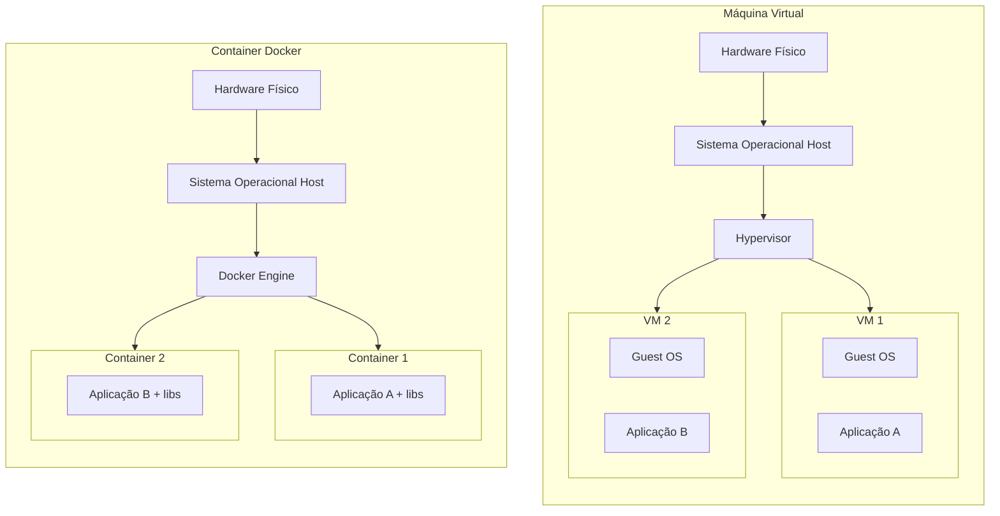

| Característica | Máquina Virtual (VM) | Container Docker |
|---|---|---|
| **Sistema Operacional** | Cada VM tem seu próprio SO completo | Todos compartilham o kernel do host |
| **Tamanho** | Gigabytes (inclui SO completo) | Megabytes (apenas aplicação e dependências) |
| **Tempo de inicialização** | Minutos | Segundos ou milissegundos |
| **Isolamento** | Muito forte (nível de hardware virtual) | Forte (nível de processo e namespace) |
| **Consumo de memória** | Alto (SO + aplicação) | Baixo (apenas aplicação) |
| **Portabilidade** | Baixa (arquivos grandes, formatos distintos) | Alta (imagem leve, padrão universal) |
| **Reprodutibilidade** | Moderada | Excelente |
| **Custo de infraestrutura** | Alto | Baixo |

> **Observação**
>
> VMs e containers não são mutuamente exclusivos. Em ambientes de produção modernos, é comum rodar containers Docker dentro de VMs, obtendo o melhor dos dois mundos: isolamento forte da VM e leveza dos containers.

### Como o Docker Engine Funciona

O **Docker Engine** é o coração do Docker. Ele é um software que roda no sistema operacional host e é responsável por criar, executar e gerenciar containers.

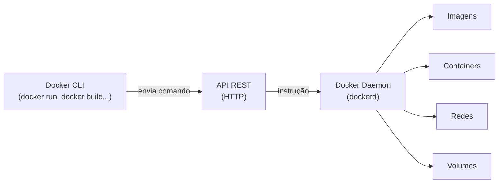

| Componente | Função |
|---|---|
| **Docker Daemon (`dockerd`)** | Processo em segundo plano que gerencia todos os objetos Docker. Escuta chamadas da API. |
| **Docker CLI (`docker`)** | Ferramenta de linha de comando que envia instruções ao daemon via API REST. |
| **API REST** | Interface de comunicação que permite que ferramentas de terceiros também controlem o Docker. |

Internamente, o Docker usa duas funcionalidades do kernel Linux:

| Tecnologia | O que controla |
|---|---|
| **Namespaces** | Isolamento — o que o container enxerga (processos, rede, filesystem, usuários) |
| **cgroups (Control Groups)** | Limites — o quanto de CPU, memória e I/O o container pode consumir |

### Vantagens e Desvantagens do Docker

| Vantagens | Desvantagens |
|---|---|
| Portabilidade total — "Build once, run anywhere" | Curva de aprendizado inicial |
| Isolamento seguro entre aplicações | Persistência de dados requer atenção especial a volumes |
| Mesmo ambiente em desenvolvimento, testes e produção | Containers mal configurados representam riscos de segurança |
| Muito mais leve que VMs | Em alguns cenários de I/O, pode ser inferior ao acesso direto ao disco |
| Containers sobem em segundos | Orquestração em escala exige ferramentas adicionais (Kubernetes) |
| Dockerfile versionável com Git | Depuração interna pode ser mais complexa para iniciantes |
| Ecossistema rico no Docker Hub | — |

### Quando Usar e Quando Não Usar Docker

| Usar Docker | Evitar Docker |
|---|---|
| Aplicações web e APIs REST | Acesso direto a hardware (drivers, dispositivos físicos) |
| Arquitetura de microsserviços | Sistemas embarcados com recursos extremamente limitados |
| Ambientes de desenvolvimento em equipe | Quando a sobrecarga de rede do container é inaceitável |
| Pipelines de CI/CD | Projetos simples e solitários sem necessidade de portabilidade |
| Distribuição padronizada para clientes | — |

---

## 2. O que é um Container

### Definição Profunda

Um container não é uma máquina virtual. Não é um processo simples. É uma **unidade de execução isolada** que encapsula uma aplicação junto com todas as suas dependências — bibliotecas, configurações, arquivos de sistema — em um ambiente completamente separado dos demais processos do sistema operacional host.

A analogia da **caixa de ferramentas** funciona bem aqui: imagine que cada projeto tem sua própria caixa de ferramentas separada, com exatamente as versões corretas de cada ferramenta que ele precisa, sem compartilhar com outros projetos. Se um projeto precisa de um martelo de 500g e outro precisa de um de 300g, cada caixa tem o martelo certo — e eles nunca se confundem.

### Isolamento: Namespaces do Kernel

Quando um container é criado, o Docker usa **namespaces do kernel Linux** para criar uma visão isolada do sistema para esse container:

| Namespace | O que isola |
|---|---|
| **PID** | Árvore de processos — o processo principal enxerga a si mesmo como PID 1 |
| **Network** | Interface de rede, IP, portas — dois containers podem usar a porta 3000 simultaneamente |
| **Mount** | Sistema de arquivos — o container não enxerga os arquivos do host (sem volumes explícitos) |
| **UTS** | Hostname — o container pode ter nome diferente do host |
| **User** | Usuários e grupos — mapeados para usuários do host |
| **IPC** | Mecanismos de comunicação entre processos |

### cgroups — Controle de Recursos

Enquanto os namespaces controlam **o que o container enxerga**, os **cgroups (Control Groups)** controlam **o quanto de recursos ele pode usar**:

| Recurso | Exemplo de limitação |
|---|---|
| CPU | No máximo 50% de um núcleo |
| Memória RAM | No máximo 512 MB |
| I/O de disco | Leitura/escrita limitada por segundo |
| Rede | Largura de banda máxima |

> **Importante**
>
> Sem cgroups, um container com comportamento anormal poderia consumir todos os recursos da máquina e derrubar os demais. O controle de recursos é essencial em ambientes onde múltiplos containers compartilham o mesmo host.

### Filesystem em Camadas

O container tem um sistema de arquivos próprio, baseado na imagem que o originou. Esse filesystem é construído em **camadas sobrepostas** (layers), usando um sistema chamado **Union File System**.

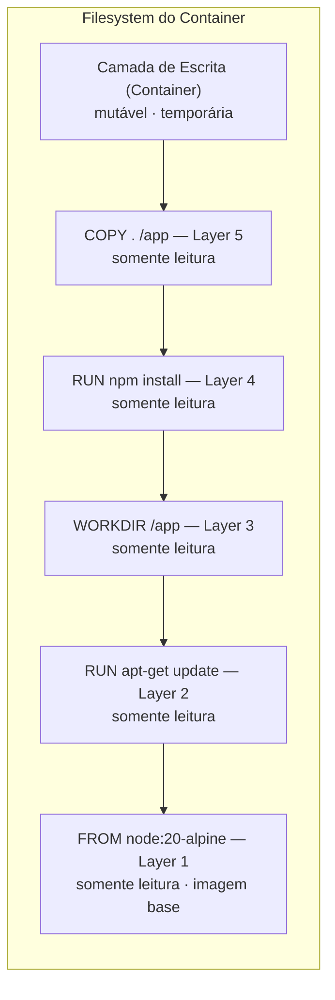

> **Observação**
>
> As camadas de imagem são somente leitura. Quando um container é criado, uma camada adicional de escrita é adicionada no topo. Quando o container é removido, essa camada desaparece — por isso containers são **efêmeros** por natureza.

### Ciclo de Vida de um Container

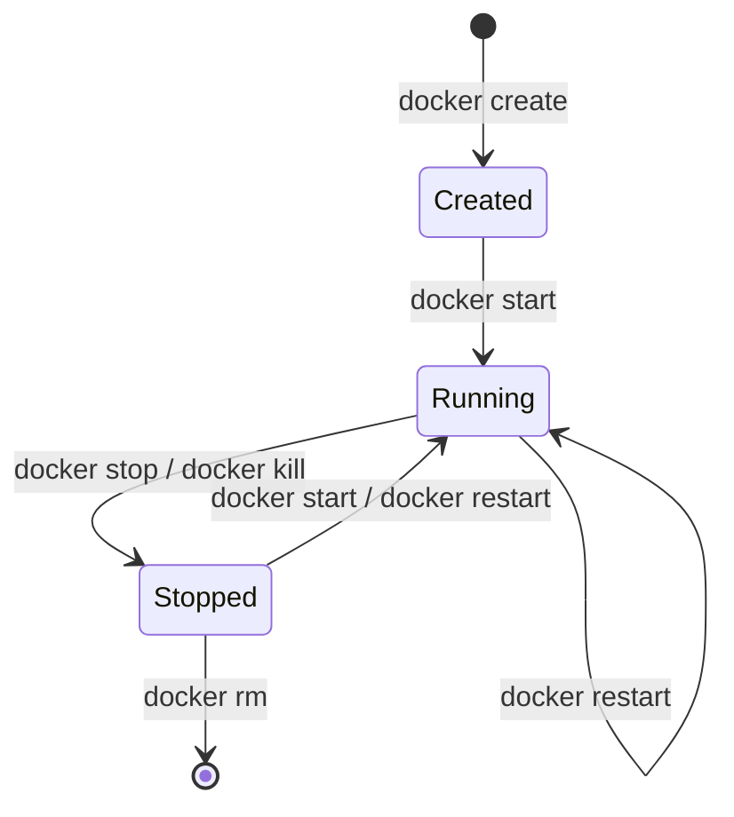

| Estado | Descrição |
|---|---|
| **Created** | Container criado a partir da imagem, ainda não iniciado |
| **Running** | Container em execução, processos ativos |
| **Stopped (Exited)** | Container parado, filesystem ainda existe |
| **Removed** | Container deletado permanentemente |

### Persistência com Volumes

Por padrão, todo dado gerado dentro de um container é perdido quando ele é removido. Para persistir dados, o Docker oferece **volumes** — diretórios gerenciados pelo Docker que existem fora do filesystem efêmero do container.

```bash
# Criando um volume nomeado
docker volume create meus-dados

# Usando um volume em um container
docker run -v meus-dados:/app/data minha-imagem
```

---

## 3. Imagem vs Container

### A Analogia da Receita de Bolo

Uma **imagem Docker** é como uma **receita de bolo**. Ela descreve, passo a passo, como o bolo deve ser feito: quais ingredientes usar, em que quantidade, em que ordem misturar, a temperatura do forno. A receita em si não é o bolo — é apenas a descrição de como fazê-lo.

Um **container Docker** é o **bolo pronto**. É o resultado da execução da receita. Você pode fazer dez bolos com a mesma receita, e todos serão iguais. Mas cada bolo existe de forma independente — se você comer um, os outros continuam intactos.

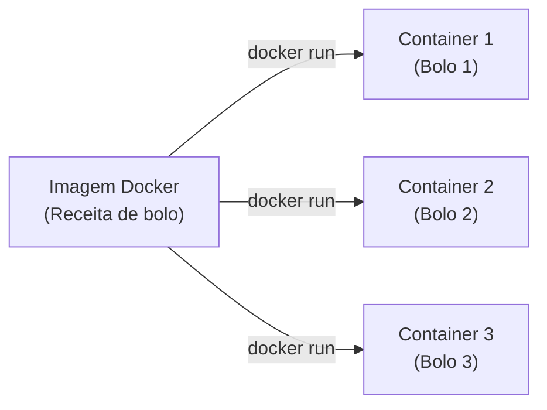

### Tabela Comparativa Completa

| Característica | Imagem | Container |
|---|---|---|
| **Definição** | Template somente leitura que descreve o ambiente | Instância em execução de uma imagem |
| **Estado** | Estático, imutável | Dinâmico, tem estado durante a execução |
| **Armazenamento** | Armazenado no disco como camadas | Memória (quando rodando) + camada de escrita |
| **Quantidade** | Uma imagem pode originar N containers | Cada container é uma instância independente |
| **Persistência** | Persiste indefinidamente até ser removida | Efêmero — dados perdidos ao remover (sem volume) |
| **Compartilhamento** | Compartilhada via Docker Hub | Local ao host onde está rodando |
| **Imutabilidade** | Completamente imutável | Camada superior é mutável durante execução |
| **Execução** | Não executa — é apenas uma especificação | Executa processos, consome CPU e memória |
| **Criação** | `docker build` ou `docker pull` | `docker run` ou `docker create` |
| **Remoção** | `docker rmi` | `docker rm` |
| **Atualização** | Requer novo build | Não se atualiza — substitui-se por novo container |
| **Tamanho** | Ocupa espaço em disco (MB a GB) | Adiciona apenas a camada de escrita |

### Reuso de Camadas entre Imagens

Se duas imagens diferentes usam a mesma imagem base (`node:20-alpine`), essa camada base **não é duplicada no disco** — ambas referenciam a mesma camada. Isso economiza espaço e acelera downloads.

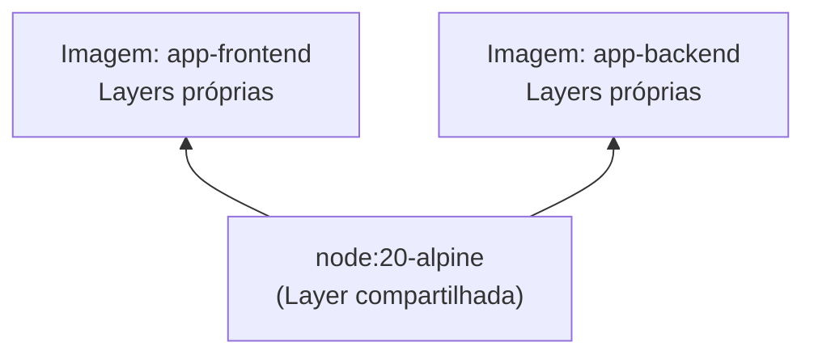

---

## 4. Docker Hub

### O que é o Docker Hub

O **Docker Hub** é o repositório público oficial de imagens Docker, mantido pela Docker, Inc. Ele funciona como um "GitHub para imagens Docker": você pode publicar suas imagens, compartilhá-las com outros, e fazer download de imagens criadas pela comunidade ou por empresas.

### Imagens Oficiais

| Imagem | Tecnologia | Uso principal |
|---|---|---|
| `node` | Node.js | Runtime para aplicações JavaScript/TypeScript |
| `nginx` | Nginx | Servidor web e proxy reverso |
| `mysql` | MySQL | Banco de dados relacional |
| `postgres` | PostgreSQL | Banco de dados relacional avançado |
| `python` | Python | Interpretador Python |
| `redis` | Redis | Cache em memória e message broker |
| `mongo` | MongoDB | Banco de dados NoSQL orientado a documentos |
| `alpine` | Alpine Linux | Imagem base ultraleve (~5 MB) |

> **Dica**
>
> As imagens oficiais passam por processos de segurança rigorosos e são atualizadas regularmente pelos mantenedores das tecnologias em parceria com a Docker, Inc. Sempre prefira imagens oficiais como base para suas imagens.

### Tags e Versionamento

Cada imagem pode ter múltiplas **tags**, que representam versões diferentes. A tag é especificada após o nome da imagem com dois-pontos:

| Tag | Significado |
|---|---|
| `node:20` | Node.js versão 20 (LTS atual) |
| `node:20-alpine` | Node.js 20 baseado no Alpine Linux (mais leve) |
| `node:18` | Node.js versão 18 |
| `node:latest` | Versão mais recente disponível (instável para produção) |
| `mysql:8.0` | MySQL versão 8.0 específica |
| `mysql:8` | MySQL 8.x mais recente |

> **Importante**
>
> Evite usar a tag `latest` em produção. Ela aponta para a versão mais recente no momento do pull, e isso pode mudar ao longo do tempo, quebrando sua aplicação com uma atualização inesperada. Sempre especifique a versão exata, como `node:20.11-alpine`.

### Operações Fundamentais

```bash
# Baixar uma imagem do Docker Hub
docker pull node:20-alpine

# Publicar uma imagem (requer login prévio)
docker login
docker push meuusuario/minha-aplicacao:1.0.0

# Buscar imagens disponíveis
docker search nginx
```

---

## 5. Dockerfile

### O que é um Dockerfile

Um **Dockerfile** é um arquivo de texto simples, sem extensão, que contém uma sequência de instruções que o Docker usa para construir uma imagem. É literalmente o "script" de construção do ambiente da sua aplicação.

A beleza do Dockerfile está em sua simplicidade: ele é um arquivo de texto que pode ser versionado com Git, revisado em code review, e compartilhado com a equipe. Qualquer pessoa pode ler um Dockerfile e entender exatamente qual ambiente a aplicação precisa para rodar.

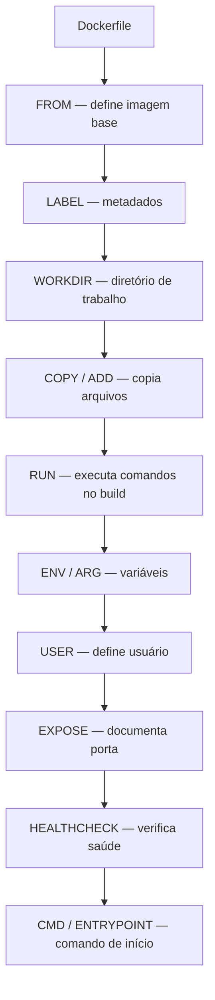

### Todas as Instruções Explicadas

#### `FROM`
Define a imagem base a partir da qual sua imagem será construída. Todo Dockerfile começa com um `FROM`. É a fundação do ambiente.

```dockerfile
FROM node:20-alpine
```

#### `WORKDIR`
Define o diretório de trabalho dentro do container. Todos os comandos subsequentes serão executados a partir desse diretório. Se o diretório não existir, ele é criado automaticamente.

```dockerfile
WORKDIR /app
```

#### `COPY`
Copia arquivos e diretórios do contexto de build (sua máquina local) para dentro da imagem. É a forma mais comum de incluir o código da aplicação.

```dockerfile
COPY package.json ./
COPY src/ ./src/
```

#### `ADD`
Similar ao `COPY`, mas com funcionalidades extras: pode descompactar arquivos `.tar.gz` automaticamente e pode baixar arquivos de URLs. Prefira `COPY` quando não precisar dessas funcionalidades extras — é mais explícito e previsível.

```dockerfile
ADD arquivo.tar.gz /destino/
```

#### `RUN`
Executa um comando durante o processo de build da imagem. Cada instrução `RUN` cria uma nova camada. Usado para instalar dependências, compilar código, criar diretórios, etc.

```dockerfile
RUN npm install --production
RUN apt-get update && apt-get install -y curl
```

#### `CMD`
Define o comando padrão que será executado quando o container iniciar. Pode ser sobrescrito ao executar `docker run`. Deve existir apenas um `CMD` por Dockerfile.

```dockerfile
CMD ["node", "server.js"]
```

#### `ENTRYPOINT`
Similar ao `CMD`, mas define o executável principal do container de forma mais rígida. Quando usado em conjunto com `CMD`, o `ENTRYPOINT` define o executável e o `CMD` define os argumentos padrão.

```dockerfile
ENTRYPOINT ["node"]
CMD ["server.js"]
```

#### `ENV`
Define variáveis de ambiente que estarão disponíveis tanto durante o build quanto durante a execução do container.

```dockerfile
ENV NODE_ENV=production
ENV PORT=3000
```

#### `ARG`
Define variáveis que só existem durante o processo de build. Diferente do `ENV`, não ficam disponíveis no container em execução. Úteis para parâmetros de configuração do build.

```dockerfile
ARG BUILD_VERSION=1.0.0
```

#### `EXPOSE`
Documenta qual porta a aplicação usa internamente. É uma declaração informativa — não publica a porta automaticamente. A publicação efetiva acontece com o `-p` no `docker run`.

```dockerfile
EXPOSE 3000
```

#### `LABEL`
Adiciona metadados à imagem, como autor, versão e descrição. Útil para organização e rastreabilidade em ambientes com muitas imagens.

```dockerfile
LABEL maintainer="glaucia@email.com"
LABEL version="1.0.0"
```

#### `USER`
Define qual usuário executará os processos dentro do container. Por segurança, é uma boa prática não executar a aplicação como root.

```dockerfile
USER node
```

#### `VOLUME`
Declara um ponto de montagem de volume dentro do container. Dados escritos nesse caminho serão persistidos fora do container.

```dockerfile
VOLUME ["/app/uploads"]
```

#### `HEALTHCHECK`
Define um comando que o Docker executa periodicamente para verificar se o container está funcionando corretamente. Um container pode estar "rodando" mas não estar "saudável" — o HEALTHCHECK faz essa distinção.

```dockerfile
HEALTHCHECK --interval=30s --timeout=10s --retries=3 \
  CMD curl -f http://localhost:3000/health || exit 1
```

### Tabela Resumo das Instruções

| Instrução | Fase | Finalidade |
|---|---|---|
| `FROM` | Build | Define a imagem base |
| `LABEL` | Build | Adiciona metadados à imagem |
| `ARG` | Build | Variável disponível apenas durante o build |
| `ENV` | Build + Runtime | Variável disponível no build e no container |
| `WORKDIR` | Build | Define o diretório de trabalho |
| `COPY` | Build | Copia arquivos locais para a imagem |
| `ADD` | Build | Copia arquivos com descompressão/download |
| `RUN` | Build | Executa comando e cria nova camada |
| `USER` | Build + Runtime | Define o usuário dos processos |
| `EXPOSE` | Documentação | Documenta a porta usada pela aplicação |
| `VOLUME` | Runtime | Declara ponto de montagem para persistência |
| `HEALTHCHECK` | Runtime | Define verificação de saúde do container |
| `ENTRYPOINT` | Runtime | Define o executável principal do container |
| `CMD` | Runtime | Define comando padrão (sobrescritível) |

### Dockerfile Completo — Exemplo Real com Node.js

```dockerfile
# ─────────────────────────────────────────────────────────────────────────────
# Imagem base: Node.js 20 sobre Alpine Linux.
# Alpine reduz o tamanho final para ~65 MB versus ~1.1 GB do node:20 Debian.
# ─────────────────────────────────────────────────────────────────────────────
FROM node:20-alpine

# Metadados para rastreabilidade da imagem
LABEL maintainer="Glaucia Costa <glaucia@email.com>"
LABEL description="Aplicação Node.js containerizada"
LABEL version="1.0.0"

# Informa ao Node.js que estamos em produção — ativa otimizações
# e desativa logs de debug em muitas bibliotecas.
ENV NODE_ENV=production

# Porta em que a aplicação escutará. Usar variável de ambiente
# facilita a mudança sem alterar o código da aplicação.
ENV PORT=3000

# Define /app como diretório de trabalho dentro do container.
# Se o diretório não existir, o Docker o cria automaticamente.
WORKDIR /app

# Copia APENAS os arquivos de dependências ANTES do código-fonte.
# Estratégia de cache: se package.json não mudar, o npm install
# não será re-executado em builds futuros, economizando tempo.
COPY package.json package-lock.json ./

# Instala apenas dependências de produção.
# --omit=dev exclui ferramentas de desenvolvimento,
# reduzindo o tamanho da imagem e a superfície de ataque.
RUN npm install --omit=dev

# Copia o restante do código DEPOIS das dependências.
# Isso garante que mudanças no código não invalidem o cache do npm install.
COPY . .

# Usa o usuário 'node' (não-root) já presente na imagem oficial.
# Rodar como root dentro de um container é um risco de segurança.
USER node

# Declara que a aplicação usa a porta 3000.
# Instrução informativa — a publicação acontece com -p no docker run.
EXPOSE 3000

# Verificação de saúde a cada 30 segundos.
# Essencial em ambientes orquestrados como Docker Compose e Kubernetes
# para que o sistema saiba quando o container está genuinamente pronto.
HEALTHCHECK --interval=30s --timeout=10s --start-period=15s --retries=3 \
  CMD wget -qO- http://localhost:3000/health || exit 1

# Comando de inicialização da aplicação.
# Forma de array (exec form) não passa por shell intermediário,
# garantindo que o processo Node.js receba sinais do sistema corretamente.
CMD ["node", "src/server.js"]
```

---

## 6. docker build

### Como o Build Funciona

O comando `docker build` lê o Dockerfile e executa cada instrução em ordem, criando uma camada de imagem para cada uma. O processo ocorre dentro de um **contexto de build** — o diretório (geralmente `.`) que você especifica ao final do comando.

```bash
# Sintaxe básica
docker build -t nome-da-imagem:tag .

# Exemplos práticos
docker build -t minha-app:1.0.0 .
docker build -t minha-app:latest .
docker build -t usuario/minha-app:1.0.0 .
```

### Fluxo do Build

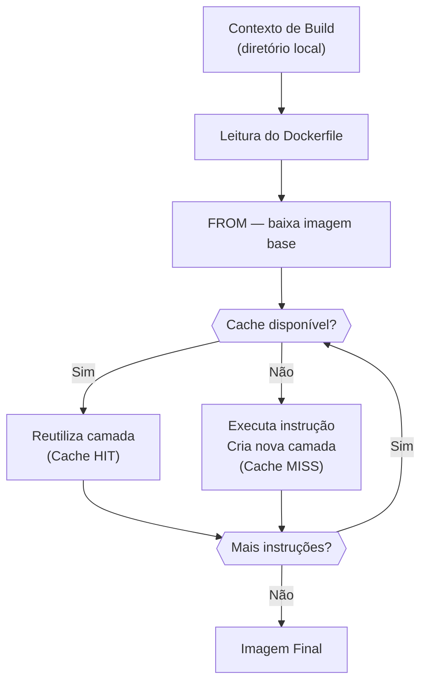

### Cache de Build

Um dos recursos mais importantes do `docker build` é o **cache por camada**. O Docker verifica se a instrução e seus inputs mudaram desde o último build. Se não mudaram, ele **reutiliza a camada em cache** em vez de reexecutar a instrução.

```
[Cache HIT]   FROM node:20-alpine          → usa camada cacheada
[Cache HIT]   COPY package.json ./         → usa camada cacheada
[Cache HIT]   RUN npm install              → usa camada cacheada (deps não mudaram)
[Cache MISS]  COPY . .                     → reconstrói (código mudou)
[Rebuilding]  CMD ["node", "src/server.js"] → reconstrói
```

> **Dica**
>
> Organize o Dockerfile colocando instruções que mudam raramente no topo (imagem base, dependências) e as que mudam frequentemente embaixo (código-fonte). Isso maximiza o reuso do cache e reduz drasticamente o tempo de build.

### Listando e Gerenciando Imagens

```bash
# Lista todas as imagens locais
docker images
docker image ls

# Remove imagens não utilizadas (dangling images)
docker image prune

# Remove todas as imagens não utilizadas por nenhum container
docker image prune -a
```

---

## 7. docker run e seus Parâmetros

O `docker run` é o comando que cria e inicia um container a partir de uma imagem. É o comando mais usado no dia a dia com Docker.

```bash
docker run [OPÇÕES] IMAGEM [COMANDO]
```

### Tabela de Parâmetros Essenciais

| Parâmetro | Nome | Função |
|---|---|---|
| `-p HOST:CONTAINER` | Porta | Publica porta do container no host |
| `-v ORIGEM:DESTINO` | Volume | Monta diretório ou volume no container |
| `-d` | Detached | Executa em segundo plano |
| `-it` | Interativo | Abre terminal interativo no container |
| `--rm` | Auto-remove | Remove o container ao parar |
| `--name NOME` | Nome | Atribui nome personalizado ao container |
| `-e VARIAVEL=VALOR` | Ambiente | Define variável de ambiente |
| `--env-file ARQUIVO` | Env file | Carrega variáveis de um arquivo `.env` |

### Exemplos Práticos de Cada Parâmetro

#### `-p` — Publicação de Portas

Mapeia uma porta do host para uma porta dentro do container. Sem isso, nenhuma porta do container é acessível externamente.

```bash
# Sintaxe: -p PORTA_HOST:PORTA_CONTAINER
docker run -p 8080:3000 minha-app
# localhost:8080 redireciona para porta 3000 do container
```

#### `-v` — Volumes

Monta um diretório do host ou um volume nomeado dentro do container.

```bash
# Volume nomeado (gerenciado pelo Docker)
docker run -v meus-dados:/app/data minha-app

# Bind mount (diretório do host)
docker run -v /home/user/uploads:/app/uploads minha-app

# Em Windows
docker run -v C:\Users\user\uploads:/app/uploads minha-app
```

#### `-d` — Modo Detached

Executa o container em segundo plano, liberando o terminal.

```bash
docker run -d -p 3000:3000 minha-app
# Terminal fica livre; container continua rodando em background
```

#### `-it` — Modo Interativo

Combina `-i` (manter stdin aberto) com `-t` (alocar pseudo-TTY). Essencial para acessar um shell dentro do container.

```bash
docker run -it node:20-alpine sh
# Você entra dentro do container e pode executar comandos
```

#### `--rm` — Remover ao Parar

Remove automaticamente o container quando ele para. Ideal para containers temporários.

```bash
docker run --rm -it node:20-alpine node -e "console.log('Hello!')"
# Container é criado, executa o comando e é removido automaticamente
```

#### `--name` — Nome do Container

Atribui um nome personalizado ao container.

```bash
docker run --name meu-servidor -d -p 3000:3000 minha-app
```

#### `-e` — Variáveis de Ambiente

Define variáveis de ambiente dentro do container.

```bash
docker run -e NODE_ENV=production -e DATABASE_URL=mysql://... minha-app

# Usando um arquivo .env
docker run --env-file .env minha-app
```

---

## 8. Gerenciamento de Containers

### Tabela de Comandos

| Comando | Função | Exemplo |
|---|---|---|
| `docker ps` | Lista containers em execução | `docker ps` |
| `docker ps -a` | Lista todos os containers (incluindo parados) | `docker ps -a` |
| `docker stop` | Para o container graciosamente (SIGTERM) | `docker stop meu-app` |
| `docker start` | Inicia container parado | `docker start meu-app` |
| `docker restart` | Reinicia container | `docker restart meu-app` |
| `docker logs` | Exibe logs do container | `docker logs -f meu-app` |
| `docker exec` | Executa comando em container ativo | `docker exec -it meu-app sh` |
| `docker rm` | Remove container parado | `docker rm meu-app` |
| `docker rm -f` | Remove container ativo forçadamente | `docker rm -f meu-app` |
| `docker rmi` | Remove imagem | `docker rmi minha-app:1.0.0` |

### Exemplos Detalhados

#### `docker ps` — Listar Containers

```bash
# Lista containers em execução
docker ps

# Lista TODOS os containers, incluindo os parados
docker ps -a

# Lista apenas os IDs
docker ps -q
```

#### `docker stop` — Parar com Elegância

Envia o sinal `SIGTERM` para o processo principal do container, pedindo que ele encerre graciosamente. Após 10 segundos, envia `SIGKILL`.

```bash
docker stop meu-servidor
docker stop abc123def456    # usando o ID do container
```

#### `docker logs` — Inspecionar Saída

```bash
# Exibe todos os logs do container
docker logs meu-servidor

# Segue os logs em tempo real (equivalente a tail -f)
docker logs -f meu-servidor

# Exibe apenas as últimas 50 linhas
docker logs --tail 50 meu-servidor
```

#### `docker exec` — Entrar no Container

```bash
# Abre shell interativo dentro do container
docker exec -it meu-servidor sh

# Executa comando específico sem abrir shell
docker exec meu-servidor ls /app

# Verifica variáveis de ambiente do container
docker exec meu-servidor env
```

#### `docker rm` e `docker rmi` — Limpeza

```bash
# Remove container parado
docker rm meu-servidor

# Remove container ativo forçadamente
docker rm -f meu-servidor

# Remove todos os containers parados de uma vez
docker container prune

# Remove imagem específica
docker rmi minha-app:1.0.0

# Remove todas as imagens não utilizadas
docker image prune -a
```

---

## 9. Docker Compose

### Por que o Docker Compose Surgiu

Imagine que sua aplicação tem três componentes: a aplicação web em Node.js, um banco de dados MySQL e um servidor de cache Redis. Para rodar tudo manualmente, você precisaria de três comandos `docker run` separados, cada um com suas opções de porta, volume, variáveis de ambiente e rede. Precisaria também garantir que os containers iniciassem na ordem certa e que pudessem se comunicar entre si.

Isso rapidamente se torna impraticável. O **Docker Compose** surgiu para resolver exatamente esse problema: definir toda a infraestrutura da aplicação em um único arquivo declarativo.

### O que é Orquestração

**Orquestração** é o processo de coordenar múltiplos containers para que funcionem juntos como uma aplicação coesa. O Docker Compose é uma ferramenta de orquestração local que permite:

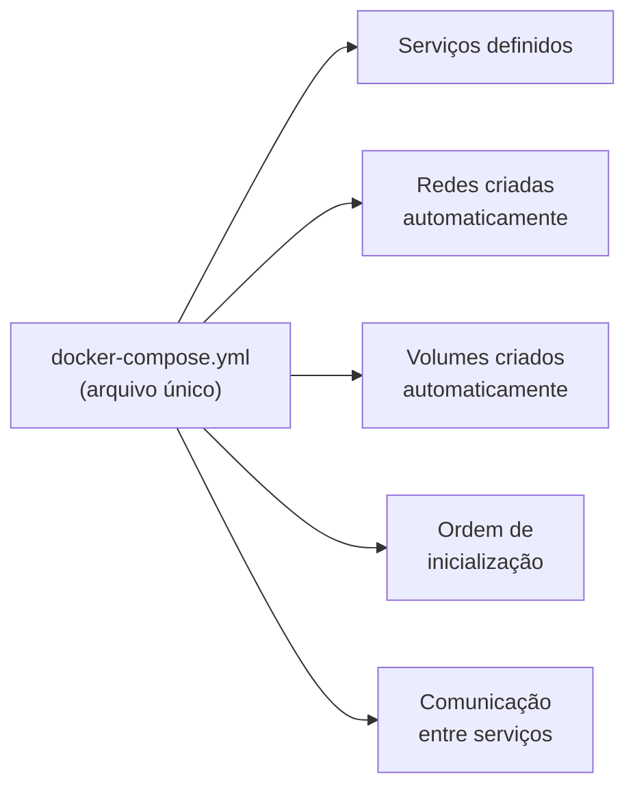

### Diretivas do `docker-compose.yml` Explicadas

| Diretiva | Nível | Função |
|---|---|---|
| `services` | Raiz | Lista todos os containers da aplicação |
| `build` | Service | Constrói a imagem a partir de Dockerfile local |
| `image` | Service | Usa imagem pronta do Hub ou registry privado |
| `container_name` | Service | Nome fixo para o container criado |
| `ports` | Service | Mapeia portas host:container |
| `volumes` | Service | Monta volumes ou bind mounts |
| `environment` | Service | Define variáveis de ambiente |
| `depends_on` | Service | Define dependências de inicialização |
| `restart` | Service | Política de reinicialização em caso de falha |
| `networks` | Service | Redes às quais o serviço pertence |
| `healthcheck` | Service | Verificação de saúde do container |
| `volumes` | Raiz | Declara volumes nomeados gerenciados pelo Docker |
| `networks` | Raiz | Declara redes personalizadas |

### Políticas de Restart

| Valor | Comportamento |
|---|---|
| `no` | Não reinicia (padrão) |
| `always` | Sempre reinicia, inclusive na inicialização do Docker |
| `on-failure` | Reinicia apenas quando encerrado com código de erro |
| `unless-stopped` | Reinicia sempre, exceto se parado manualmente |

> **Importante**
>
> `depends_on` garante que o container *iniciou*, não que está *pronto para receber conexões*. Para verificar prontidão real, use `condition: service_healthy` em conjunto com um `HEALTHCHECK` definido no serviço dependido.

### Exemplo Completo de `docker-compose.yml`

```yaml
# Versão do esquema Docker Compose (3.8 tem ampla compatibilidade)
version: "3.8"

services:

  # ──────────────────────────────────────────────────────────────────────────
  # SERVIÇO: Aplicação Web em Node.js / Next.js
  # ──────────────────────────────────────────────────────────────────────────
  app:
    build:
      context: .
      dockerfile: Dockerfile

    container_name: neurosync-app

    environment:
      NODE_ENV: production
      PORT: 3000
      DB_HOST: db          # 'db' é o hostname do serviço MySQL nesta rede
      DB_PORT: 3306
      DB_USER: app_user
      DB_PASSWORD: senha_segura
      DB_NAME: neurosync

    ports:
      - "3000:3000"

    volumes:
      - ./src:/app/src    # hot reload em desenvolvimento

    depends_on:
      db:
        condition: service_healthy    # aguarda MySQL estar saudável

    restart: unless-stopped

    networks:
      - app-network

  # ──────────────────────────────────────────────────────────────────────────
  # SERVIÇO: Banco de Dados MySQL
  # ──────────────────────────────────────────────────────────────────────────
  db:
    image: mysql:8.0

    container_name: neurosync-db

    environment:
      MYSQL_ROOT_PASSWORD: root_senha_segura
      MYSQL_DATABASE: neurosync
      MYSQL_USER: app_user
      MYSQL_PASSWORD: senha_segura

    volumes:
      - dados-mysql:/var/lib/mysql                                  # dados persistentes
      - ./database/init.sql:/docker-entrypoint-initdb.d/init.sql   # script de inicialização

    healthcheck:
      test: ["CMD", "mysqladmin", "ping", "-h", "localhost"]
      interval: 10s
      timeout: 5s
      retries: 5
      start_period: 30s

    restart: unless-stopped

    networks:
      - app-network

# ────────────────────────────────────────────────────────────────────────────
# VOLUMES: armazenamento persistente gerenciado pelo Docker
# ────────────────────────────────────────────────────────────────────────────
volumes:
  dados-mysql:
    driver: local

# ────────────────────────────────────────────────────────────────────────────
# NETWORKS: rede interna para comunicação entre containers
# ────────────────────────────────────────────────────────────────────────────
networks:
  app-network:
    driver: bridge
```

### Comandos Essenciais do Docker Compose

| Comando | Função |
|---|---|
| `docker compose up -d` | Inicia todos os serviços em background |
| `docker compose up -d --build` | Inicia e força rebuild das imagens |
| `docker compose down` | Para e remove containers e redes |
| `docker compose down -v` | Para, remove containers, redes e volumes |
| `docker compose ps` | Lista containers do projeto |
| `docker compose logs -f` | Segue logs de todos os serviços |
| `docker compose logs -f app` | Segue logs de um serviço específico |
| `docker compose exec app sh` | Abre shell em serviço em execução |
| `docker compose restart app` | Reinicia um serviço específico |

---

## 10. O que Acontece ao Executar `docker compose up`

Quando você executa `docker compose up`, o Docker Compose orquestra uma série de etapas em sequência. O diagrama abaixo ilustra o fluxo completo:

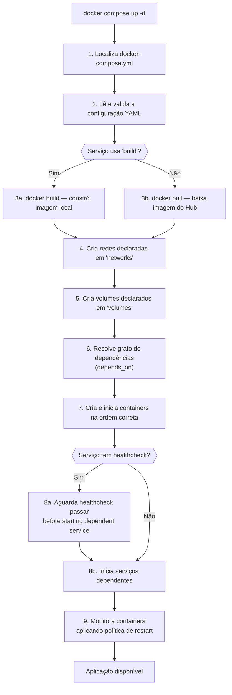

### Descrição Passo a Passo

| Passo | Ação | Detalhes |
|---|---|---|
| **1** | Localiza o arquivo | Procura `docker-compose.yml` no diretório atual, subindo na hierarquia se não encontrar |
| **2** | Valida a configuração | Lê e analisa o YAML; erros de sintaxe são detectados antes de qualquer ação |
| **3** | Resolve imagens | Para serviços com `build:`, executa `docker build`; para serviços com `image:`, faz `docker pull` se necessário |
| **4** | Cria redes | Cria as redes definidas em `networks:`; se não houver, cria `<projeto>_default` automaticamente |
| **5** | Cria volumes | Cria volumes definidos em `volumes:`; volumes existentes são reutilizados, preservando dados |
| **6** | Resolve dependências | Constrói grafo de dependências a partir dos `depends_on` e determina ordem de criação |
| **7** | Cria containers | Instancia cada container com portas, volumes, variáveis de ambiente e conexão à rede |
| **8** | Verifica saúde | Se `condition: service_healthy`, aguarda healthcheck passar antes de iniciar serviços dependentes |
| **9** | Monitora | Em modo `-d`, monitora containers e aplica políticas de `restart` em caso de falha |

---

## 11. Fluxo Completo do Docker

O diagrama abaixo mostra o caminho completo desde o código-fonte até a aplicação em produção:

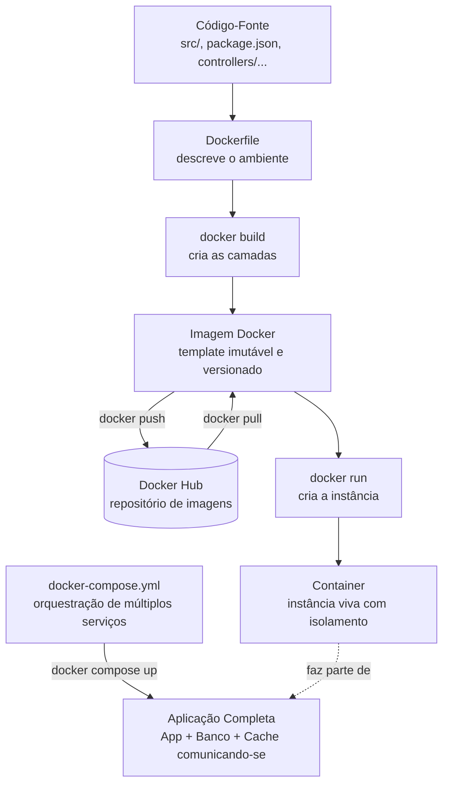

---

## 12. Caso Real — GalaxyFlix

### Sobre o Projeto

O **GalaxyFlix** é um projeto de aplicação web desenvolvido como parte do processo de aprendizado, que utilizou Docker durante toda a fase de desenvolvimento para garantir portabilidade e padronização do ambiente entre todos os colaboradores.

### Problema que o Docker Resolveu

Antes do uso do Docker, era necessário que cada desenvolvedor configurasse manualmente seu ambiente local: instalar as versões corretas das linguagens, configurar bancos de dados, ajustar variáveis de ambiente e resolver conflitos entre diferentes projetos que compartilhavam a mesma máquina. Esse processo era lento e gerava inconsistências.

### Arquitetura com Docker

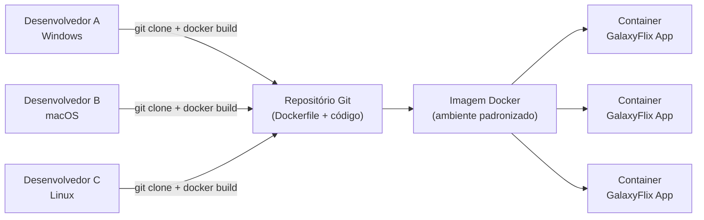

### Benefícios Obtidos

| Benefício | Descrição |
|---|---|
| **Reprodutibilidade** | Ambiente idêntico em todas as máquinas dos desenvolvedores |
| **Portabilidade** | A imagem funcionava em Windows, macOS e Linux sem ajustes |
| **Onboarding rápido** | `docker compose up` era suficiente para ter tudo funcionando |
| **Isolamento** | O projeto não interferia em outros projetos na mesma máquina |
| **Padronização** | Eliminou o problema "funciona na minha máquina" completamente |

---

## 13. Caso Real — NeuroSync

### Sobre o NeuroSync

O **NeuroSync** é um sistema web para gerenciamento de clínicas de psicologia, desenvolvido como Trabalho de Conclusão de Curso (TCC). A aplicação oferece funcionalidades como cadastro de pacientes, agendamento de sessões, registro de evoluções clínicas e gestão financeira para psicólogos autônomos e clínicas.

### Stack Tecnológica


| Camada | Tecnologia | Responsabilidade |
|---|---|---|
| **Frontend** | Next.js + React + TypeScript | Interface do usuário e renderização server-side |
| **Backend** | Node.js (via Next.js API Routes) | Regras de negócio e endpoints REST |
| **Banco de Dados** | MySQL 8.0 | Persistência de dados clínicos |
| **Containerização** | Docker + Docker Compose | Orquestração e padronização do ambiente |

### Arquitetura com Docker Compose

O NeuroSync é composto por serviços independentes, cada um com responsabilidade bem definida:

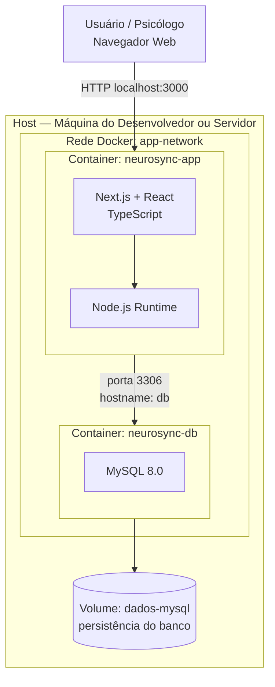

### Responsabilidade de Cada Serviço

| Serviço | Container | Tecnologia | Responsabilidade |
|---|---|---|---|
| `app` | `neurosync-app` | Next.js + Node.js | Frontend, API, regras de negócio |
| `db` | `neurosync-db` | MySQL 8.0 | Armazenamento de todos os dados |

### Comunicação entre Serviços

Um dos recursos mais poderosos do Docker Compose é a **resolução de nomes por serviço**. Na rede interna `app-network`, o container `app` consegue se conectar ao MySQL simplesmente usando `db` como hostname — o Docker Compose resolve automaticamente esse nome para o endereço IP interno do container correto.

```bash
# Conexão do código Node.js com o banco de dados
DB_HOST=db       # 'db' é o nome do serviço no docker-compose.yml
DB_PORT=3306
DB_NAME=neurosync
```

Isso significa que **nenhum endereço IP precisa ser configurado manualmente**, e que ao reiniciar os containers (mesmo que recebam novos IPs internos), a comunicação continua funcionando sem qualquer alteração.

### Por que o Docker foi Escolhido para o TCC

A escolha do Docker para o NeuroSync não foi apenas técnica — foi também estratégica para o futuro do sistema:

#### Durante o Desenvolvimento

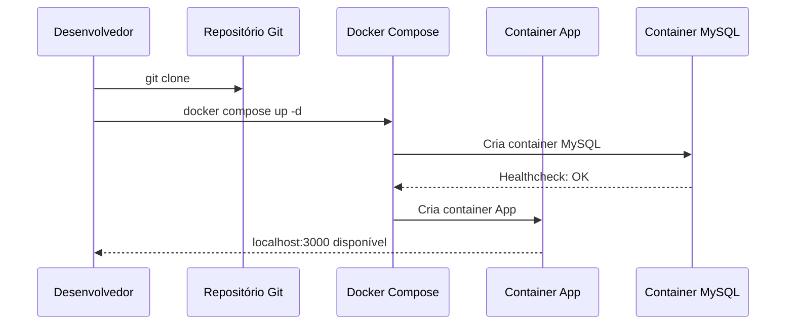

| Benefício | Como o Docker viabilizou |
|---|---|
| **Onboarding rápido** | `docker compose up` — ambiente completo em minutos |
| **Sem conflitos de versão** | Cada container tem suas próprias versões do Node.js e MySQL |
| **Ambiente idêntico** | Qualquer membro da equipe tem o mesmo ambiente |
| **Testes isolados** | Banco de dados em container separado, sem afetar ambiente local |

#### Para CI/CD

Pipelines de integração contínua podem usar a mesma imagem Docker para rodar testes, garantindo que o ambiente de CI seja idêntico ao de desenvolvimento e produção. O processo de build e deploy torna-se automatizável e confiável.

#### Para Distribuição Futura

O Docker foi escolhido porque permitirá futuramente **distribuir o NeuroSync para clínicas com uma instalação completamente padronizada**. Em vez de contratar um técnico para configurar cada servidor, a clínica pode receber um conjunto de arquivos (`docker-compose.yml` + imagem) e iniciar o sistema com um único comando.

| Cenário de Distribuição | Com Docker | Sem Docker |
|---|---|---|
| **Instalação em novo servidor** | `docker compose up` | Horas de configuração manual |
| **Atualização do sistema** | Nova versão de imagem + `docker compose pull` | Atualização manual com risco de quebrar config |
| **Rollback em caso de falha** | `docker compose up` com imagem anterior | Rollback complexo e arriscado |
| **Onboarding de clínica nova** | Mesmo arquivo para todas as clínicas | Configuração única por cliente |

### Fluxo Completo de Uso com Docker

```bash
# 1. Clonar o repositório
git clone https://github.com/usuario/neurosync.git
cd neurosync

# 2. Criar o arquivo de variáveis de ambiente a partir do exemplo
cp .env.example .env
# Editar .env com as credenciais do ambiente

# 3. Iniciar toda a aplicação com um único comando
docker compose up -d

# 4. Verificar se todos os serviços estão saudáveis
docker compose ps

# 5. Acessar a aplicação
# http://localhost:3000

# 6. Acompanhar logs em tempo real
docker compose logs -f app

# 7. Parar tudo quando não precisar mais
docker compose down
```

---

## 14. Boas Práticas

### `.dockerignore` — Excluindo o Desnecessário

Assim como o `.gitignore` instrui o Git a ignorar arquivos, o `.dockerignore` instrui o Docker a excluir arquivos do contexto de build. Sem ele, a pasta `node_modules` (centenas de MB) e credenciais podem ser enviados desnecessariamente ao daemon do Docker.

```dockerignore
# Dependências (serão instaladas dentro do container via npm install)
node_modules/
npm-debug.log*

# Arquivos do Git
.git/
.gitignore

# Variáveis de ambiente com credenciais — nunca incluir no contexto de build
.env
.env.*
!.env.example

# Artefatos de build locais
dist/
build/
.next/

# Documentação e testes (desnecessários na imagem de produção)
docs/
*.md
*.test.js
*.spec.js

# Arquivos do sistema operacional
.DS_Store
Thumbs.db
```

### Não Executar como Root

Por padrão, os processos dentro de um container rodam como `root`. Isso é um risco de segurança: se um atacante conseguir executar código arbitrário, ele terá privilégios de administrador. A imagem oficial do Node.js inclui um usuário não-root chamado `node`.

```dockerfile
# Ao final do Dockerfile, antes do CMD
USER node
```

### Imagens Alpine — Tamanho Reduzido

| Variante | Tamanho Aproximado | Base |
|---|---|---|
| `node:20` | ~1.1 GB | Debian Bookworm |
| `node:20-slim` | ~240 MB | Debian (sem extras) |
| `node:20-alpine` | ~65 MB | Alpine Linux |

> **Dica**
>
> Imagens menores significam downloads mais rápidos, menos superfície de ataque para vulnerabilidades e menores custos de armazenamento e transferência em registries e pipelines de CI/CD.

### Multi-stage Build — Imagem de Produção Enxuta

O **multi-stage build** usa múltiplas etapas em um único Dockerfile: uma para compilar o código e outra para a imagem final de produção, copiando apenas os artefatos necessários.

```dockerfile
# ─── Estágio 1: Build ───────────────────────────────────────────────────────
FROM node:20-alpine AS builder
WORKDIR /app
COPY package*.json ./
RUN npm install
COPY . .
RUN npm run build

# ─── Estágio 2: Produção (imagem final enxuta) ──────────────────────────────
FROM node:20-alpine AS production
WORKDIR /app

# Copia apenas os artefatos compilados do estágio anterior
COPY --from=builder /app/dist ./dist
COPY --from=builder /app/node_modules ./node_modules

USER node
CMD ["node", "dist/server.js"]
```

O resultado final não contém código-fonte, ferramentas de desenvolvimento, arquivos de configuração do build, nem o TypeScript compiler — apenas o mínimo necessário para executar a aplicação.

### Variáveis de Ambiente — Nunca Hardcode de Credenciais

Nunca coloque senhas, chaves de API ou credenciais diretamente no Dockerfile ou no `docker-compose.yml` versionado no repositório.

```bash
# .env  ← NÃO versionar (adicionar ao .gitignore)
DB_PASSWORD=minha_senha_super_secreta
JWT_SECRET=chave_jwt_ultra_secreta
API_KEY=chave_da_api_externa
```

```yaml
# docker-compose.yml  ← versionado, sem segredos em texto plano
environment:
  DB_PASSWORD: ${DB_PASSWORD}
  JWT_SECRET: ${JWT_SECRET}
```

### Healthcheck — Monitoramento de Saúde

Adicione `HEALTHCHECK` a serviços críticos. A diferença entre um container "em execução" e um container "saudável" pode ser crucial em deploys automatizados e orquestrados.

```dockerfile
HEALTHCHECK --interval=30s --timeout=10s --retries=3 \
  CMD curl -f http://localhost:3000/health || exit 1
```

### Cache Otimizado — Ordem das Instruções

Organize o Dockerfile para maximizar o reuso do cache. Instruções que mudam raramente devem sempre vir antes das que mudam com frequência:

```dockerfile
# Correto: dependências (raramente mudam) antes do código (muda sempre)
COPY package*.json ./
RUN npm install
COPY . .

# Errado: invalida cache do npm install toda vez que o código muda
COPY . .
RUN npm install
```

### Resumo das Boas Práticas

| Prática | Benefício |
|---|---|
| Usar `.dockerignore` | Builds mais rápidos, contexto menor, sem vazar credenciais |
| Não executar como root | Menor superfície de ataque em caso de exploração |
| Usar imagens Alpine | Imagem menor, mais rápida de baixar e com menos vulnerabilidades |
| Multi-stage build | Imagem de produção enxuta, sem artefatos de desenvolvimento |
| Variáveis de ambiente | Credenciais fora do código-fonte versionado |
| HEALTHCHECK | Monitoramento real de disponibilidade, não apenas "processo rodando" |
| Ordem de instruções | Cache de build eficiente, builds rápidos |

---

## 15. Conclusão

O Docker não é apenas uma ferramenta — é uma mudança de paradigma na forma como desenvolvemos, testamos e implantamos software. Antes da containerização, a diferença entre ambientes (desenvolvimento, homologação, produção) era uma fonte constante de problemas, atrasos e frustrações. Com o Docker, o ambiente se torna parte do código: versionável, reproduzível, compartilhável e auditável.

### Docker e o Desenvolvimento Moderno

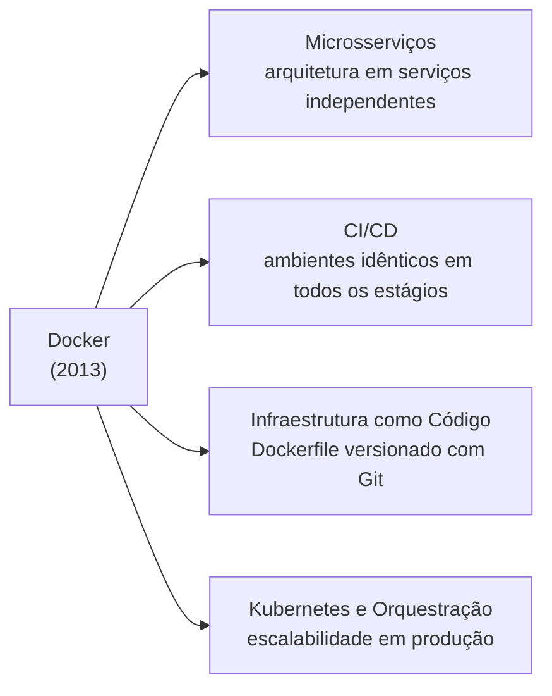

| Área | Impacto do Docker |
|---|---|
| **Microsserviços** | Viabilizou arquiteturas onde cada serviço é desenvolvido, implantado e escalado de forma independente |
| **DevOps e CI/CD** | Ambientes idênticos entre desenvolvimento e produção tornaram pipelines mais confiáveis |
| **Infraestrutura como Código** | Dockerfile e `docker-compose.yml` são configuração de ambiente versionável junto ao código |
| **Escalabilidade** | Containers escalam horizontalmente com facilidade em plataformas de nuvem |
| **Redução de custos** | Menos recursos de infraestrutura, deploys mais rápidos, menor tempo de inatividade |

### Por que é uma das Tecnologias Mais Importantes

Desde o lançamento em 2013, o Docker se tornou onipresente na indústria de tecnologia. Praticamente toda empresa que desenvolve software — das startups às grandes corporações — utiliza containers em alguma parte de seu ciclo de desenvolvimento. Plataformas de nuvem como AWS, Google Cloud e Azure possuem serviços dedicados à execução e orquestração de containers.

O Docker reduziu a barreira de entrada para práticas de DevOps, tornou o onboarding de desenvolvedores mais rápido, diminuiu custos de infraestrutura e aumentou a confiabilidade dos deploys. É difícil imaginar o ecossistema de desenvolvimento moderno sem ele.

### A Perspectiva dos Projetos

Nos projetos apresentados neste trabalho — **GalaxyFlix** e **NeuroSync** — o Docker demonstrou na prática todos esses benefícios: padronização do ambiente, facilidade de onboarding, portabilidade entre diferentes sistemas operacionais e uma base sólida para distribuição futura do software.

Para o NeuroSync, especificamente, o Docker representa não apenas uma escolha técnica de desenvolvimento, mas uma estratégia de distribuição: permitir que clínicas de psicologia possam instalar e rodar o sistema com o mínimo de conhecimento técnico, em qualquer infraestrutura que tenha Docker disponível.

Aprender Docker hoje não é mais um diferencial — é uma habilidade fundamental para qualquer desenvolvedor de software que queira trabalhar em equipe, contribuir com projetos modernos ou construir sistemas que funcionem de forma confiável em produção.

---

## 16. Referências

### Referências no Formato ABNT

DOCKER INC. **Docker Documentation**. Disponível em: https://docs.docker.com. Acesso em: 18 jun. 2026.

DOCKER INC. **Dockerfile reference**. Disponível em: https://docs.docker.com/reference/dockerfile. Acesso em: 18 jun. 2026.

DOCKER INC. **Docker Compose overview**. Disponível em: https://docs.docker.com/compose. Acesso em: 18 jun. 2026.

DOCKER INC. **Docker Hub**. Disponível em: https://hub.docker.com. Acesso em: 18 jun. 2026.

NODE.JS FOUNDATION. **Dockerizing a Node.js web app**. Disponível em: https://nodejs.org/en/docs/guides/nodejs-docker-webapp. Acesso em: 18 jun. 2026.

DOCKER INC. **GitHub — Docker**. Disponível em: https://github.com/docker. Acesso em: 18 jun. 2026.

### Recursos Recomendados

| Recurso | Tipo | Descrição |
|---|---|---|
| [Documentação Oficial Docker](https://docs.docker.com) | Documentação | Referência completa e atualizada de todos os comandos e conceitos |
| [Dockerfile Reference](https://docs.docker.com/reference/dockerfile) | Documentação | Todas as instruções do Dockerfile com exemplos detalhados |
| [Docker Compose Docs](https://docs.docker.com/compose) | Documentação | Guia completo do Docker Compose com exemplos de uso |
| [Docker Hub](https://hub.docker.com) | Repositório | Imagens oficiais e da comunidade para download |
| [GitHub Docker](https://github.com/docker) | Código-fonte | Projetos e ferramentas oficiais Docker em código aberto |
| [Node.js Docker Guide](https://nodejs.org/en/docs/guides/nodejs-docker-webapp) | Tutorial | Guia oficial para containerizar aplicações Node.js |

---

<div align="center">

  

  **Desenvolvido como material de apoio acadêmico**

  Glaucia da Costa Santos · Junho de 2026

  *"Funciona na minha máquina? Agora funciona em qualquer máquina."*

</div>
